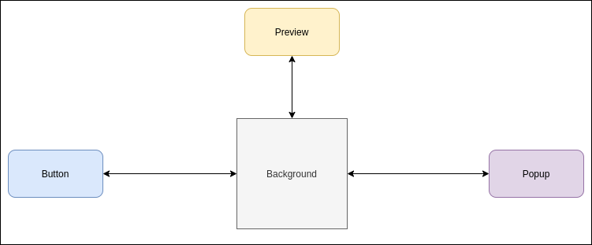

# Snapshot Extension

Creation of a web extension that allows to take a snapshot of the current web page.

## Requirements

- Should shown a button inside all the user navigation pages that
  allow the user to take snapshot of the current page when clicks on
  the button.
- The snapshot should be shown in a new tab of the browser.
- Should be compatible with manifest v2
- The web extension should be loaded in the developer mode on Chrome

# Solution

## Diagram

## Base

The button is handled in a content script so it is placed on all the user navigation pages.

Once the button is clicked then a message is sent to the background script, a callback is given and the button hides itself.

Once the background script receives the message to take a snapshot it creates
a new tab (preview).

When the new tab is completely loaded the background sends a message with the snapshot information to the tab, this information is the src generated. Then passes the callback given by the button to the tab.

The tab receives the message with the snapshot information and places the src
received to the src on the the image element to see that snapshot, then executes the callback so the button is visible again.

## Extra

It has a basic filter per domain.

With this filter the background script has a small modification on the snapshot creation.

Now it checks that the current domain is allowed and then proceeds to create the new tab and send the information.

In case the domain is not allowed then nothing will happen.

The filtering is handled with a popup script. It has two buttons:

- block
- allow

The button to block will be disabled when the domain is already blocked.
Once the button to block is clicked a message to the background is passed to add this domain to the local storage of domains not allowed.

The button to allow will be disabled when the domain is already allowed.
Once the button to allow is clicked a message to the background is passed to remove this domain from the local storage of domains not allowed.

## APIs used

- chrome.tabs

  - create
  - sendMessage
  - query
  - captureVisibleTab
  - onUpdated

- chrome.storage.local

  - get
  - set

- chrome.extension

  - getURL

- chrome.runtime
  - onMessage
  - sendMessage
